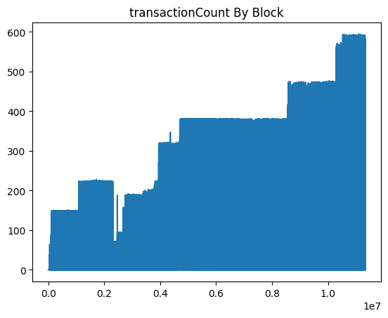

# 08 . Estimation du temps d'éxécution total du script

### Objectifs
- Prendre des données des tables SQL et en faire un graphique.
- Prouver la faisabilité et déterminer la méthode pour de prochains graphiques.

## Pourquoi?
- Pour mieux compendre nos données, d'abord nous les visualisons.

## 0. Préambule

Nous avons réfléchi dans un premier temps aux graphiques que nous aimerions voir et aux informations qui nous serviront plus tard. 
Nous définissons alors 3 tables sql:
- une 1ère qui contient les informations relatives aux blocs.
- une 2ème qui tient l'historique des transactions (et une colonnes si la transaction est susceptible d'impliquer une baleine).
- une 3ème qui retient les adresses disponibles sur eth et si oui ou non nous la définissons comme une baleine.

`REMARQUES`:
- Dans la 3ème table `isWhale` n'est pas forcément `bool`(binaire), on peut aussi définir des types de holder (ex: `exchange`, `particulier`, `test`, `active`, `inactive`).
- La 3ème table peut potentiellement contenir toutes les adresses possibles, même si nous estimons qu'il y en a plusieurs dizaines de millions, cela reste un nombre de lignes correct pour SQL, avec des requêtes ~ 10s
- La table 1 permet de faire le lien avec la table 2 qui correpond au prix auquel a pu s'échanger l'ETH.
- La table 2 NE DOIT PAS accueillir toutes les transactions, on en compte plusieurs milliards. Les récupérer serait très douleureux à traiter, et nous allons essayer de ne pas avoir de bases de données trop lourdes.  

```
TABLE block_info
+--------+-----------+------------------+-------+--------+
| number | timestamp | transactionCount | price | volume |
+--------+-----------+------------------+-------+--------+

TABLE tx
+------+-------+-------+----+-------------+--------+
| from | nonce | value | to | blocknumber | whale? |
+------+-------+-------+----+-------------+--------+

TABLE holders
+------+---------+-------+
| addr | balance | whale? |
+------+---------+-------+
```

Construction d'un premier graphique qui rend compte du nombre de transactions par bloc, du block 0 à 11327362 ~ 25/11/2020


### 1. Créer la table qui accueille les données
```shell script
mysql> create table block_info (`number` int primary key,`transactionCount` int, `timestamp` int);
Query OK, 0 rows affected (0,13 sec)

mysql> describe block_info;
+------------------+------+------+-----+---------+-------+
| Field            | Type | Null | Key | Default | Extra |
+------------------+------+------+-----+---------+-------+
| number           | int  | NO   | PRI | NULL    |       |
| transactionCount | int  | YES  |     | NULL    |       |
| timestamp        | int  | YES  |     | NULL    |       |
+------------------+------+------+-----+---------+-------+
3 rows in set (0,02 sec)
```

### 2. ETH To SQL
*Remplir la table SQL précédemment créée avec les infos de la blockchain ETH*  
`blockCount.py`
````python
from gql import gql, Client
from gql.transport.aiohttp import AIOHTTPTransport
from tqdm import tqdm
import time
import pymysql


PAD = 1000
LAST_PROCESSED_BLOCK = 0
START_BLOCK = LAST_PROCESSED_BLOCK
END_BLOCK = 11327362


def queryQL(START_BLOCK, END_BLOCK):

    transport = AIOHTTPTransport(url="http://127.0.0.1:8545/graphql")
    client = Client(transport=transport, fetch_schema_from_transport=True, execute_timeout=120)
    query = gql(
        """
            {
                blocks(from: """ + str(START_BLOCK) + """ , to: """ + str(END_BLOCK) + """) {
                    number
                    transactionCount
                    timestamp
                }
            }
        """
    )
    return client.execute(query)


def processGraphQlQuery(rep):

    _list = []
    for block in rep['blocks']:
        _list.append((int(block['number'], 16), block['transactionCount'], int(block['timestamp'], 16)))

    return _list


def commit(addr_tab):

    if len(addr_tab) != 0:
        conn = pymysql.connect("127.0.0.1", "root", "******", "ETH")
        cur = conn.cursor()
        _str = "REPLACE INTO block_info (`number`, `transactionCount`, `timestamp`) VALUES "
        for addr in addr_tab:
            _str += str(addr) + ','
        _str = _str[:-1] + ';'
        cur.execute(_str)
        conn.commit()
        cur.close()
        conn.close()


def main():

   block = START_BLOCK
   ITR = int((END_BLOCK - START_BLOCK) / PAD)
   _itr = 0
   for _itr in tqdm(range(ITR)):
       _itr += 1
       _list = processGraphQlQuery(queryQL(block, block + PAD))
       commit(_list)
       block += PAD


if __name__ == '__main__':

    tt = time.time()
    main()
    print("\ntotal time exection: {}".format(time.time() - tt))
````

`Vamos a executar el scripto`
```shell script
~ python3 blockCount.py
100%|██████████| 11327/11327 [2:53:49<00:00,  1.09it/s]
total time exection: 10429.651278018951

mysql> select transactionCount, number, timestamp from block_info order by transactionCount desc limit 10;
+------------------+----------+------------+
| transactionCount | number   | timestamp  |
+------------------+----------+------------+
|              595 | 11090550 | 1603164453 |
|              594 | 11155653 | 1604027478 |
|              593 | 10954973 | 1601350018 |
|              593 | 10662704 | 1597468675 |
|              593 | 10954556 | 1601344238 |
|              593 | 10876613 | 1600305253 |
|              593 | 10564500 | 1596160817 |
|              593 | 10571010 | 1596247389 |
|              593 | 10765890 | 1598839705 |
|              593 | 10527069 | 1595659336 |
+------------------+----------+------------+
10 rows in set (3,38 sec)

mysql> select count(*) from block_info;
+----------+
| count(*) |
+----------+
| 11327001 |
+----------+
1 row in set (0,88 sec)
```
- GraphQL ne récupère pas toutes les infos puisqu'on récupère 11327001 blocks dans la table SQL mais on en a 11 327 362 sur notre noeud. Notre script avec Graphql n'est pas 100%     efficace puiqu'il oublie 361 blocks. 
- De plus, l'éxécution est un peu longue: 10429s ~ 2h 53 min49s

### 3. SQL To matplotlib.pyplot
`plotTxByBlock.py` 
```python
import numpy as np
import matplotlib.pyplot as plt
import pymysql
import time

t = time.time()
conn = pymysql.connect("127.0.0.1", "root", "******", "ETH")
cur = conn.cursor()
cur.execute('select `transactionCount` from `block_info`;')
results = cur.fetchall()
results_as_list = [i[0] for i in results]
array = np.fromiter(results_as_list, dtype=np.int32)

x = np.array(range(0, len(array)))
y = np.array(array)
plt.plot(x, y)
plt.title('transactionCount By Block')
plt.savefig('txByBlock.png', bbox_inches='tight')
print(time.time() - t) # 110s
plt.show()
```

|  |
|:--:|
| *Évolution du nombre de transactions dans un block de 0 à * 11327362 ~ block du 25/11/2020* |


### A faire : estimation du temps d'éxécution
