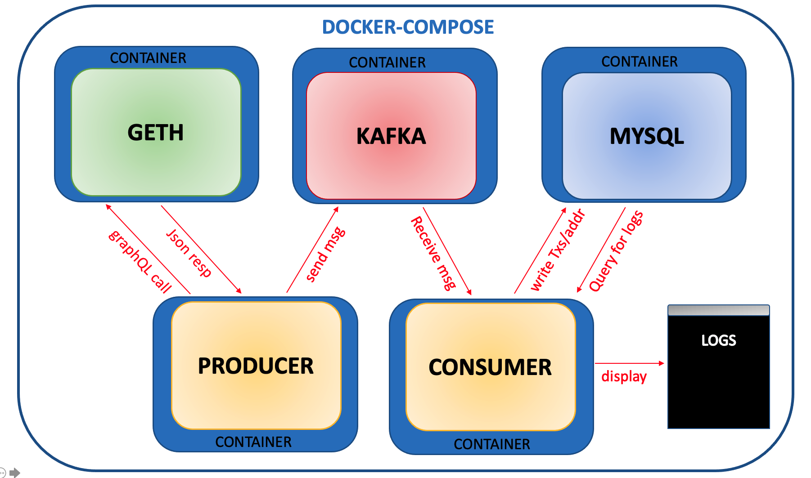
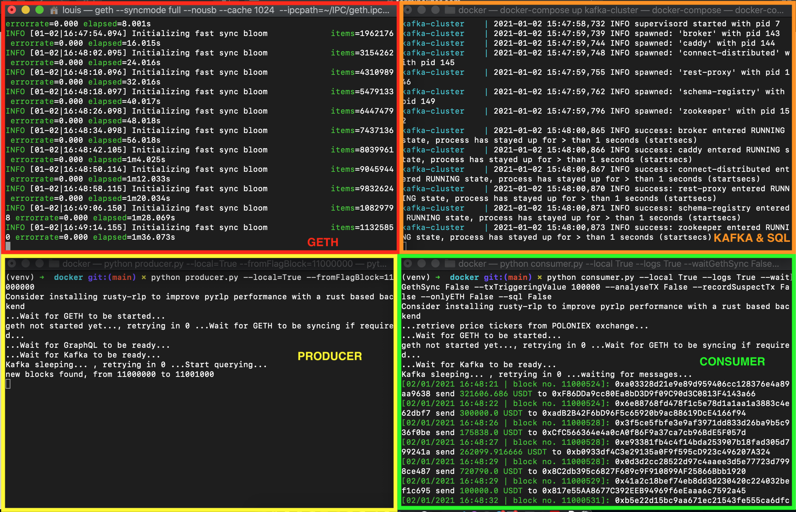
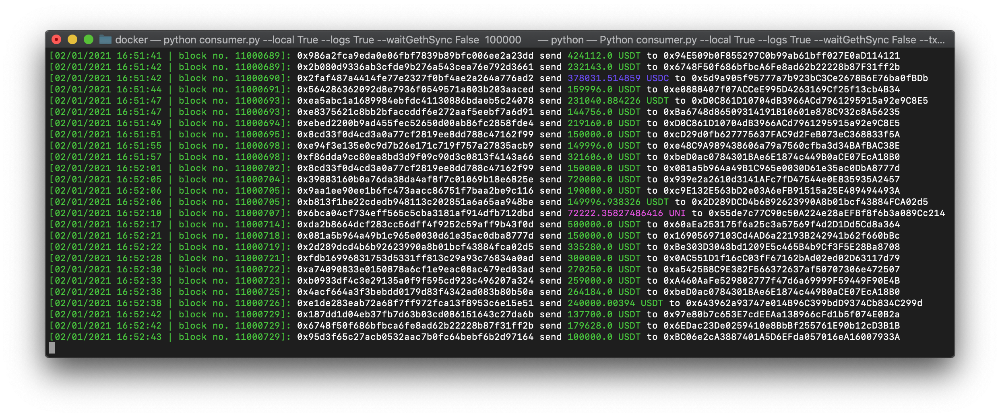

# 11 . Solution retenue

*Au début, nous souhaitions développé une solution totalement dockerisée, c'est à dire faite de conteneur Docker qui intéragissent entre eux. 
Au cours du développement, nous avons recontré de nombreuses difficultées quand à la dockerisation du logiciel. 
Nous avons donc pensé notre rendu final de façon à ce qu'il soit possible d'exécuter ou non certains conteneurs, et donc 
d'éxéctuer une partie du logiciel en local et l'autre partie sur la machine docker. Conceptualiser de cette facon, si un potentiel utilisateur venait à utiliser ces scripts, il y aurait une simple 
facon de faire (éxécuter un `docker-compose.yml`), et la possibilité d'exécuté les composants séparemment.*


## I. Présentation de la solution

Notre solution finale se consistue de plusieurs fichiers qui permettent l'orchestration des différents conteneurs.

```
 . 
 └── docker/
    ├── utils.py
    ├── consumer.py
    ├── producer.py
    ├── Dockerfile
    └── docker-compose.yml

```

- `utils.py`: contient des méthodes pour créer des logs et stocker de grosses variables affin de faciliter la lecture de `producer.py` et de `consumer.py`
- `producer.py`: effectue des requetes graphql sur la blockchain et les envoies les réponses le plus brute possible dans au `consumer.py`
- `consumer.py`: traitent les réponses des requêtes, les enregistres dans un base de données et affiche des logs.
- `DockerFile`: permet de créer une image python personaliser afin de créer des conteneurs capables d'éxécuter `producer.py` et `consumer.py`
- `docker-compose.yml`: orchestre les différents conteuneurs entre eux.

---

`La solution est pensée pour être modulaire`:
- Le producer et le consumer peuvent être executer dans un conteneur ou bien en locale en fonction des arguments que l'on fournit.
- Ils peuvent analyser les transactions de la blockchain depuis le debut ou bien reprendre aux derniers blocs téléchargés.
- Le consumer à la possibilité de ne pas interagir avec SQL, de sorte à n'afficher que des logs
- Le consumer peut prendre des critères de selections pour les transactions qui doivent être traités. 

`exemple`:
```shell script
~ python producer.py --local True --fromFlagBlock 11000000
~ python consumer.py --local False --logs True --waitGethSync False --txTriggeringValue 100000 --analyseTX False --recordSuspectTx False --onlyETH False --sql False
```

`Explication des arguments`:
```
python producer.py --local               # bool: if executed on host or on container
                   --fromFlagBlock       # int: start querying blockchain from this block number

python producer.py --local               # bool: if executed on host or on container
                   --logs                # bool: display logs on consumer console

                   --waitGethSync        # bool: wait for geth to be syncing (False if geth runs with --maxpeers 0,
                                            useful with --fromFlagBlock if does not require to have the last blocs)

                   --txTriggeringValue   # int: value in dollar from which transactions as to be considered
                   --onlyETH             # bool: proccess only transactions conserning ETH or token also

                   --sql                 # bool: if SQL is up and as to be used or not
                   --analyseTX           # bool: Check in database if 'from' and 'to' addresses from transactions 
                                            has been registered and will do so if not

                   --recordSuspectTx     # bool: dump transactions into suspect_tx sql table
```


|  |
|:--:|
| *Schema de la solution entièrement dockerisée* |


## II. Fonctionnement actuel de la solution

### ÉTAPES
- Faire tourner le noeud Geth en locale
- Monter les conteneurs SQL et Kafka-cluster du docker-compose
- Executer `producer.py`
- Executer `consumer.py`


## 1. Faire tourner le noeud Geth en locale
```shell script
~ geth --syncmode full --nousb --cache 1024 --datadir=/Volumes/ETH/.ethereum/.ethereum \
  --ipcpath=~/IPC/geth.ipc --http --http.api eth,web3,personal --graphql --maxpeers 0
```

## 2. Monter les conteneurs SQL et Kafka-cluster du docker-compose
```shell script
~ docker-compose up --detach
```

## 3. Executer `producer.py`
```shell script
~ cd docker
~ source ../../venv/bin/activate
~ python producer.py --local=True --fromFlagBlock=11000000
```

## 3. Executer `consumer.py`
```shell script
~ cd docker
~ source ../../venv/bin/activate
~ python consumer.py --local True --logs True --waitGethSync False --txTriggeringValue 100000 \
  --analyseTX False --recordSuspectTx False --onlyETH False --sql False
```


|  |
|:--:|
| *Apercu de la solution en état de marche* |

|  |
|:--:|
| *Zoom sur les logs du consumer.py* |

## III. Fonctionnement souhaité de la solution

`docker-compose.yml`
```Dockerfile
version: '3.1'

services:
  geth:
    image: ethereum/client-go
    container_name: geth
    command: --syncmode full --nousb --cache 4096 --ipcpath=~/IPC/geth.ipc \
      --http --http.api eth,web3,personal --graphql --http.addr 0.0.0.0 --http.corsdomain "*"
    ports:
      - 8545:8545
      - 30303:30303
    volumes:
      - "/Volumes/ETH/.ethereum/.ethereum:/root/.ethereum"
    restart: unless-stopped

  sql:
    image: mysql
    container_name: sql
    ports:
    - "3306:3306"
    environment:
      MYSQL_ROOT_PASSWORD: pwd
      MYSQL_USER: pi2
      MYSQL_PASSWORD: pwd
      MYSQL_DATABASE: ETH
    restart: unless-stopped

  kafka-cluster:
    image: landoop/fast-data-dev
    container_name: kafka-cluster
    environment:
      ADV_PORT: "9092"
      ADV_HOST: 127.0.0.1
      RUNTESTS: 0                 # Disable Running tests so the cluster starts faster
      FORWARDLOGS: 0              # Disable running 5 file source connectors that bring application logs into Kafka topics
      SAMPLEDATA: 0               # Do not create sea_vessel_position_reports, nyc_yellow_taxi_trip_data, reddit_posts topics with sample Avro records.
    ports:
    - 2181:2181                 # Zookeeper
    - 3030:3030                 # Landoop UI
    - 8081-8083:8081-8083       # REST Proxy, Schema Registry, Kafka Connect ports
    - 9581-9585:9581-9585       # JMX Ports
    - 9092:9092                 # Kafka Broker
    restart: unless-stopped

  py-producer:
    image: img-python
    container_name: py-producer
    command: python /pi2/producer.py --fromFlagBlock=10000000
    depends_on:
      - kafka-cluster
    restart: unless-stopped

  py-consumer:
    image: img-python
    container_name: py-consumer
    command: python /pi2/consumer.py --logs True --waitGethSync False --txTriggeringValue 100000 --analyseTX False --recordSuspectTx False --onlyETH False --sql False
    depends_on:
      - kafka-cluster
    restart: unless-stopped
```

## IV. Fonctionnement alternatif
#0. Get Geth running
```shell script
~ geth --syncmode full --nousb --cache 1024 --datadir=/Volumes/ETH/.ethereum/.ethereum \
    --ipcpath=~/IPC/geth.ipc --http --http.api eth,web3,personal --graphql --maxpeers 0
```

\
I. Go inside DockerFile directory
```shell script
~ cd docker
```
\
II. Build img-python from Dockerfile
```shell script
~ docker build -t img-python .
```
\
III. Build containers in the background
```shell script
~ docker-compose up --detach
```
\
IV. View containers logs
```shell script
~ docker-compose logs --follow
```
\
V. Shutdown gracefully before backing up sql ETH databases  
```shell script
~ sh shutdown.sh
```
`shutdown.sh`:
```shell script
if [ "$(docker ps -q -f name=sql)" ]; then
    echo "...Move the last backup to a safe place if this goes wrong..."
    mv /Volumes/ETH/pi2/sql/mysql-dump/backupiswhale.sql /Volumes/ETH/pi2/sql/backup || $1
    
    echo '...Regsiter the new backup. Dumping iswhale table...'
    docker exec -i sql mysqldump -ppwd ETH iswhale > /Volumes/ETH/pi2/sql/mysql-dump/backupiswhale.sql 
fi

echo '...docker-compose kill...'
docker-compose kill
```

## Run py-producer & py-consumer in local | kafka-cluster & sql in docker
\
I. Go inside DockerFile directory
```shell script
~ cd docker
```
\
II. Build img-python from Dockerfile
```shell script
~ docker build -t img-python .
```
\
III. Docker-compose sql & kafka-cluster containers
```shell script
~ docker-compose up sql kafka-cluster
```
\
IV. Open 2 other shells and enter the virtual env
```shell script
~ cd docker
~ source ../../venv/bin/activate
```
\
V. Run py-consumer & py-producer
```shell script
~ python producer.py --local=True --fromFlagBlock=11000000
~ python consumer.py --local True --logs True --waitGethSync False --txTriggeringValue 100000
```

## Run py-producer & py-consumer in local | kafka-cluster in docker | sql excluded
\
I. Go inside DockerFile directory
```shell script
~ cd docker
```
\
II. Build img-python from Dockerfile
```shell script
~ docker build -t img-python .
```
\
III. Docker-compose sql & kafka-cluster containers
```shell script
~ docker-compose up kafka-cluster
```
\
IV. Create a virtual env
```shell script
~ virtualenv create
~ pip install -r requirements
```
\
V. Open 2 other shells and enter the virtual env
```shell script
~ cd docker
~ source venv/bin/activate
```
\
VI. Run py-consumer & py-producer
```shell script
~ python producer.py --local=True --fromFlagBlock=11000000
~ python consumer.py --local True --logs True --waitGethSync False --txTriggeringValue 100000 \
    --analyseTX False --recordSuspectTx False --sql False
```

