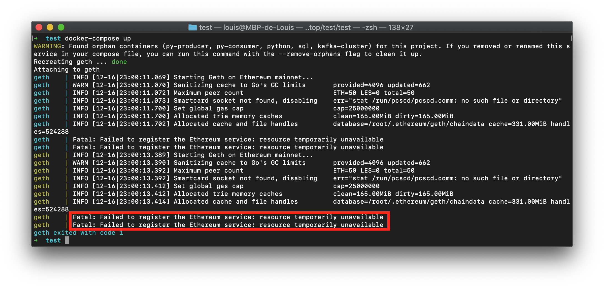

# 12 . Apprentissage, Difficultés et perspectives d'évolutions

# Apprentissage
- Geth & Ethereum - IPC-HTTP-WS & GraphQL & State Trie & Synchro
- Docker - difficultés d'utilisation de Docker avec HDD & Alpine-apk 
- 

# Prespective d'évolution
- [wait-for-it conteneur](#prespective-dévolution-1)
- [healthcheck conteneur](#rajouter-un-healtcheck-sur-les-conteneurs)
- [redis & mongodb](#remplacer-la-base-de-données-actuelles-utilisé-par-une-de-type-redis-ou-nosql)


# Difficultés
- [Enrichir l'image ethereum/client-go de python](#enrichir-limage-ethereumclient-go-de-python)
- [docker image ethereum/client-go not working](#docker-image-ethereumclient-go-not-working)
- [Pourquoi la synchronisation du noeud ne se terminera jamais avec notre solution](#pourquoi-la-synchronisation-ne-se-terminera-jamais-avec-notre-solution)
- [graphql timeout](#graphql-timeout)
- [docker too many files open in system](#docker-too-many-files-open-in-system)
- [Mysql brutal shutdown](#mysql-brutal-shutdown)

---

# Prespective d'évolution

## Attendre qu'un conteneur soit en état de marche avant d'en lancer un autre.

Dans la situation où un conteneur est dépendant du service managé par un autre conteneur, on peut signifier au docker-compose l'argument `requires` et faire de sorte à ce que ce conteneur attende le démarage d'un autre avant de se lancer. Avec cette argument, on indique que les conteneurs doivent communiquer entre eux et en plus qu'ils doivent attendre que ceux-ci soient bien démarrés avant d'être montés. Le problème c'est qu'un conteuneur peut être considéré comme UP et pourtant le service qu'il orchestre n'est pas encore disponible, pouvant causer une erreure sur d'autres conteuneurs. Pour pallier à ce problème, ou bien on implémente une logique en interne dans le code des conteneurs ou alors on rajoute un script `bash` standardiser par docker: `wait-for-it.sh`

- https://docs.docker.com/compose/startup-order/
- https://stackoverflow.com/questions/31746182/docker-compose-wait-for-container-x-before-starting-y

## Rajouter un healtcheck sur les conteneurs

Le heatlthcheck est une bonne pratique à adopter lors de la conception d'architecture qui implique l'orchestration de conteneur. Un healthcheck est un script qui vérifie le bon état de santé d'un des conteneurs en particulier. Effectivement, comme mentionné précédemment, il est possible d'avoir un conteneur UP mais que celui-ci n'est soit pas disposé à faire fonctionner le service qu'il embarque. 

## Remplacer la base de données actuelles utilisé par une de type redis ou noSQL

La base de donnée de type SQL offre l'avatange d'être simple d'utlisation puisque celle-ci implique de pensé à une struture simple mais fixe de notre solution. Il serait posssible de stocker les données de l'application dans un cadre moins relationnel afin d'obtenir une structure plus complexe. Enfin, étant donné qu'un gros défaut de notre aplication soit sa rapidité d'exécution, il serait intéressant d'étudier la possibilité d'implémenter une base de donnée de type clé:valeur à mémoire cache comme redis.   

---

# Difficultés

## Enrichir l'image ethereum/client-go de python

L'image du client geth est construite sur l'image de l'OS Alpine. C'est un système d'exploitation très léger qui a l'inconvéniant de n'inclure nativement que très peu de package. Il est posssible d'installer python d'une seule commande sur l'OS, mais certaines libraries installable par `pip` font appellent à d'autres pacakges directement installer sur l'os. De cette facon, les installations des packages pip ne marche pas et l'erreur est quelque peu complexe à déceller. Il s'agit alors de remonter dans les logs, de trouver les outils manquant et de les installer avec la commande `apk add` dans le Dockerfile.

Prblm lors de l'installation de web3 pour python
```zsh
pip install web3
```

erreur commune -> manque Cypthon.

```zsh
pip install cython
```

sur l'image docker alpine -> manque gcc
https://stackoverflow.com/questions/19580758/gcc-fatal-error-stdio-h-no-such-file-or-directory#20150282

```zsh
apk add libc-dev
```

fatal error: Python.h: No such file or directory
https://ethereum.stackexchange.com/questions/64315/web3-python-installation-failes-include-python-h-error-command-x86-64-linux
https://stackoverflow.com/questions/21530577/fatal-error-python-h-no-such-file-or-directory#21530768

```zsh
apk add python3-dev
```

https://web3py.readthedocs.io/en/stable/troubleshooting.html#setup-environment

Consider installing rusty-rlp to improve pyrlp performance with a rust based backend
```
pip install rusty-rlp
```

##### Avant avoir ajouté python
`Dockerfile`
```Dockerfile
# Build Geth in a stock Go builder container
FROM golang:1.15-alpine as builder

RUN apk add --no-cache make gcc musl-dev linux-headers git

ADD . /go-ethereum
RUN cd /go-ethereum && make geth

# Pull Geth into a second stage deploy alpine container
FROM alpine:latest

RUN apk add --no-cache ca-certificates
COPY --from=builder /go-ethereum/build/bin/geth /usr/local/bin/

EXPOSE 8545 8546 30303 30303/udp
ENTRYPOINT ["geth"]
```

##### Apres avoir ajouté python
`Dockerfile`
```Dockerfile
# Build Geth in a stock Go builder container
FROM golang:1.15-alpine as builder

RUN apk add --no-cache make gcc musl-dev linux-headers git

ADD . /go-ethereum
RUN cd /go-ethereum && make geth

# Pull Geth into a second stage deploy alpine container
FROM alpine:latest

RUN apk add --no-cache ca-certificates && \
    apk add --no-cache gcc && \
    apk add --no-cache python3-dev && \
    apk add libc-dev && \
    if [ ! -e /usr/bin/python ]; then ln -sf python3 /usr/bin/python ; fi && \
    \
    echo "**** install pip ****" && \
    python3 -m ensurepip && \
    rm -r /usr/lib/python*/ensurepip && \
    pip3 install --no-cache --upgrade pip setuptools wheel && \
    if [ ! -e /usr/bin/pip ]; then ln -s pip3 /usr/bin/pip ; fi && \
    pip install Cython && pip install web3 && pip install tqdm 

COPY --from=builder /go-ethereum/build/bin/geth /usr/local/bin/

EXPOSE 8545 8546 30303 30303/udp
ENTRYPOINT ["geth"]
```

## docker image ethereum/client-go not working

Avec la dernière version de docker, ethereum/client-go refuse de créer un service geth si il doit ecrire les données de la blockchain sur un disque dur.

```Dockerfile
version: '3.1'

services:
  geth:
    image: ethereum/client-go
    container_name: geth
    command: --syncmode full --nousb --cache 4096 --ipcpath=~/IPC/geth.ipc \
      --http --http.api eth,web3,personal --graphql --http.addr 0.0.0.0 --http.corsdomain "*"
    ports:
      - 8545:8545
      - 30303:30303
    volumes:
      - "/Volumes/ETH/.ethereum/.ethereum:/root/.ethereum"
    restart: unless-stopped
```

|  |
|:--:|
| *Shell output from docker-compose up* |

## Pourquoi la synchronisation ne se terminera jamais avec notre solution

On remarque que notre noeud ne termine pas sa synchronisation, il reste en quelque sorte bloqué 100 blocs derrière. Il s'agit de quelque chose que l'on ne pourra changer. 
En effet, même avec une très bonne connection à internet, il n'est pas possible de compléter la synchronisation de la blockchain ethereum sur un HDD. Ceci est dû a la limitation d'écriture/lecture du disque.

`explications`:
- Le mode de synchronisation par défaut de Geth est appelé fast sync. C'est la mode de synchronisation que nous avons choisit car c'est le plus rapide.
- Au lieu de partir du bloc de genèse et de retraiter toutes les transactions qui se sont produites, la fast sync télécharge les blocs et ne vérifie que la preuve de travail associée. Le téléchargement de tous les blocs est une procédure simple et rapide.
- Avoir les blocs ne veut pas dire être synchronisé. Puisque aucune transaction n'a été exécutée, nous n'avons donc aucun état de compte disponible (c'est-à-dire soldes, nonces, code de contrat intelligent et données). Ceux-ci doivent être téléchargés séparément et vérifiés avec les derniers blocs. Cette phase s'appelle le `state trie download ` et elle s'exécute en fait en même temps que les téléchargements de blocs.
- Le `state trie` est un schéma complexe de centaines de millions de preuves cryptographiques. Pour vraiment avoir un nœud synchronisé, toutes les données des `accounts` doivent être téléchargées, ainsi que toutes les preuves cryptographiques pour vérifier que personne sur le réseau n'essaie de tricher. La partie où cela devient encore plus compliqué est que ces données se transforment constamment: à chaque bloc (15s), environ 1000 nœuds sont supprimés de ce trie et environ 2000 nouveaux sont ajoutés. Cela signifie que votre nœud doit synchroniser un ensemble de données qui change 200 fois par seconde. Le pire, c'est que pendant la synchronisation, le réseau avance et l'état que vous avez commencé à télécharger peut disparaître pendant le téléchargement, de sorte que votre nœud doit constamment suivre le réseau tout en essayant de collecter toutes les données récentes. Mais tant que vous n'avez pas collecté toutes les données, votre nœud local n'est pas utilisable car il ne peut rien prouver de manière cryptographique concernant les comptes.
- Le state trie d'Ethereum contient des centaines de millions de nœuds, dont la plupart prennent la forme d'un seul hash référençant jusqu'à 16 autres hashs. C'est une très mauvaises façon de stocker des données sur un disque, car il n'y a presque pas de structure, juste des nombres aléatoires faisant référence à des nombres encore plus aléatoires. C'est problématique car cela ne permet pas d'optimiser le stockage et la recherche des données de manière significative.

*En conclusion, notre noeud ethereum restera coincée 60 à 100 blocs dernières la blockchain officielle. Cela ne nous pose pas plus de soucis que ca, cela voudra juste dire que nos analyses en temps réelles sur la blockchain auront un décalage de 10 minutes.*


## graphql timeout
On recoit beacoup d'erreur de Timeout parce que les requêtes prennent trop de temps. On peut modifier le parametre timeout dans graphQL mais cela ne resout pas à tout les coup le problème.
graphql issue: https://medium.com/workflowgen/graphql-query-timeout-and-complexity-management-fab4d7315d8d


```
 69%|██████▉   | 69/100 [07:54<03:33,  6.88s/it]
Traceback (most recent call last):
  File "/Users/louis/PycharmProjects/eth_whales/venv/lib/python3.9/site-packages/gql/transport/aiohttp.py", line 198, in execute
    async with self.session.post(self.url, ssl=self.ssl, **post_args) as resp:
  File "/Users/louis/PycharmProjects/eth_whales/venv/lib/python3.9/site-packages/aiohttp/client.py", line 1117, in __aenter__
    self._resp = await self._coro
  File "/Users/louis/PycharmProjects/eth_whales/venv/lib/python3.9/site-packages/aiohttp/client.py", line 544, in _request
    await resp.start(conn)
  File "/Users/louis/PycharmProjects/eth_whales/venv/lib/python3.9/site-packages/aiohttp/client_reqrep.py", line 890, in start
    message, payload = await self._protocol.read()  # type: ignore
  File "/Users/louis/PycharmProjects/eth_whales/venv/lib/python3.9/site-packages/aiohttp/streams.py", line 604, in read
    await self._waiter
asyncio.exceptions.CancelledError

During handling of the above exception, another exception occurred:

Traceback (most recent call last):
  File "/usr/local/Cellar/python@3.9/3.9.0_1/Frameworks/Python.framework/Versions/3.9/lib/python3.9/asyncio/tasks.py", line 487, in wait_for
    fut.result()
asyncio.exceptions.CancelledError

The above exception was the direct cause of the following exception:

Traceback (most recent call last):
  File "/Users/louis/PycharmProjects/eth_whales/script/main.py", line 108, in <module>
    main()
  File "/Users/louis/PycharmProjects/eth_whales/script/main.py", line 57, in main
    _list = processGraphQlQuery(queryQL(block, block + PAD))
  File "/Users/louis/PycharmProjects/eth_whales/script/main.py", line 37, in queryQL
    result = client.execute(query)
  File "/Users/louis/PycharmProjects/eth_whales/venv/lib/python3.9/site-packages/gql/client.py", line 167, in execute
    data: Dict[Any, Any] = loop.run_until_complete(
  File "/usr/local/Cellar/python@3.9/3.9.0_1/Frameworks/Python.framework/Versions/3.9/lib/python3.9/asyncio/base_events.py", line 642, in run_until_complete
    return future.result()
  File "/Users/louis/PycharmProjects/eth_whales/venv/lib/python3.9/site-packages/gql/client.py", line 127, in execute_async
    return await session.execute(document, *args, **kwargs)
  File "/Users/louis/PycharmProjects/eth_whales/venv/lib/python3.9/site-packages/gql/client.py", line 408, in execute
    result = await self._execute(document, *args, **kwargs)
  File "/Users/louis/PycharmProjects/eth_whales/venv/lib/python3.9/site-packages/gql/client.py", line 396, in _execute
    return await asyncio.wait_for(
  File "/usr/local/Cellar/python@3.9/3.9.0_1/Frameworks/Python.framework/Versions/3.9/lib/python3.9/asyncio/tasks.py", line 489, in wait_for
    raise exceptions.TimeoutError() from exc
asyncio.exceptions.TimeoutError
```

```shell script
100%|██████████| 100/100 [07:47<00:00,  4.68s/it]

total time exection: 467.5840919017792
```

## docker too many files open in system
On a ici une erreur très génante que l'on ne comprend pas très bien, parfois Docker crash parce que trop de fichier son ouvert dans le système. Il semblerait que l'on ne puisse pas y faire grand chose.

```shell script
 20%|█▉        | 2633/13400 [24:27<1:40:01,  1.79it/s]
Traceback (most recent call last):
  File "/Users/louis/PycharmProjects/eth_whales/script/main.py", line 108, in <module>
    main()
  File "/Users/louis/PycharmProjects/eth_whales/script/main.py", line 59, in main
    commit(_list)
  File "/Users/louis/PycharmProjects/eth_whales/script/main.py", line 65, in commit
    conn = pymysql.connect("127.0.0.1", "root", "pwd", "ETH")
  File "/Users/louis/PycharmProjects/eth_whales/venv/lib/python3.9/site-packages/pymysql/__init__.py", line 94, in Connect
    return Connection(*args, **kwargs)
  File "/Users/louis/PycharmProjects/eth_whales/venv/lib/python3.9/site-packages/pymysql/connections.py", line 327, in __init__
    self.connect()
  File "/Users/louis/PycharmProjects/eth_whales/venv/lib/python3.9/site-packages/pymysql/connections.py", line 587, in connect
    self._get_server_information()
  File "/Users/louis/PycharmProjects/eth_whales/venv/lib/python3.9/site-packages/pymysql/connections.py", line 969, in _get_server_information
    packet = self._read_packet()
  File "/Users/louis/PycharmProjects/eth_whales/venv/lib/python3.9/site-packages/pymysql/connections.py", line 646, in _read_packet
    packet_header = self._read_bytes(4)
  File "/Users/louis/PycharmProjects/eth_whales/venv/lib/python3.9/site-packages/pymysql/connections.py", line 698, in _read_bytes
    raise err.OperationalError(
pymysql.err.OperationalError: (2013, 'Lost connection to MySQL server during query')
```
```shell script
~ docker logs -f db > logs_db 
```

```shell script
~ docker run -ti -d --name db -v /Volumes/ETH/.mysql5:/var/lib/mysql -p 3306:3306 -e MYSQL_ROOT_PASSWORD=pwd mysql
docker: Error response from daemon: Bad response from Docker engine.
See 'docker run --help'.
__git_prompt_git:1: pipe failed: too many open files in system                  
parse_git_dirty:18: pipe failed: too many open files in system
```

```shell script
 26%|██▌       | 5248/20000 [18:03<50:45,  4.84it/s]  
Traceback (most recent call last):
  File "/Users/louis/PycharmProjects/eth_whales/script/main.py", line 108, in <module>
    main()
  File "/Users/louis/PycharmProjects/eth_whales/script/main.py", line 59, in main
    commit(_list)
  File "/Users/louis/PycharmProjects/eth_whales/script/main.py", line 65, in commit
    conn = pymysql.connect("127.0.0.1", "root", "pwd", "ETH")
  File "/Users/louis/PycharmProjects/eth_whales/venv/lib/python3.9/site-packages/pymysql/__init__.py", line 94, in Connect
    return Connection(*args, **kwargs)
  File "/Users/louis/PycharmProjects/eth_whales/venv/lib/python3.9/site-packages/pymysql/connections.py", line 327, in __init__
    self.connect()
  File "/Users/louis/PycharmProjects/eth_whales/venv/lib/python3.9/site-packages/pymysql/connections.py", line 587, in connect
    self._get_server_information()
  File "/Users/louis/PycharmProjects/eth_whales/venv/lib/python3.9/site-packages/pymysql/connections.py", line 969, in _get_server_information
    packet = self._read_packet()
  File "/Users/louis/PycharmProjects/eth_whales/venv/lib/python3.9/site-packages/pymysql/connections.py", line 646, in _read_packet
    packet_header = self._read_bytes(4)
  File "/Users/louis/PycharmProjects/eth_whales/venv/lib/python3.9/site-packages/pymysql/connections.py", line 698, in _read_bytes
    raise err.OperationalError(
pymysql.err.OperationalError: (2013, 'Lost connection to MySQL server during query')

~ docker exec -ti db mysql -p 
runtime: kqueue failed with 1
fatal error: runtime: netpollinit failed

goroutine 1 [running, locked to thread]:
runtime.throw(0x5a6111d, 0x1b)
	/usr/local/go/src/runtime/panic.go:617 +0x72 fp=0xc000219a88 sp=0xc000219a58 pc=0x402e9b2
runtime.netpollinit()
	/usr/local/go/src/runtime/netpoll_kqueue.go:21 +0xa9 fp=0xc000219ab8 sp=0xc000219a88 pc=0x402c539
internal/poll.runtime_pollServerInit()
	/usr/local/go/src/runtime/netpoll.go:88 +0x20 fp=0xc000219ac8 sp=0xc000219ab8 pc=0x402b150
sync.(*Once).Do(0x6fe6580, 0x5b1dbf0)
	/usr/local/go/src/sync/once.go:44 +0xb3 fp=0xc000219af8 sp=0xc000219ac8 pc=0x4071303
internal/poll.(*pollDesc).init(0xc0003480d8, 0xc0003480c0, 0x0, 0xc000219b98)
	/usr/local/go/src/internal/poll/fd_poll_runtime.go:38 +0x3d fp=0xc000219b30 sp=0xc000219af8 pc=0x40bfeed
internal/poll.(*FD).Init(0xc0003480c0, 0x5a38713, 0x4, 0x1, 0xc000000300, 0x200000003)
	/usr/local/go/src/internal/poll/fd_unix.go:63 +0x5f fp=0xc000219b60 sp=0xc000219b30 pc=0x40c095f
os.newFile(0x3, 0x5a43b67, 0xc, 0x1, 0x3)
	/usr/local/go/src/os/file_unix.go:156 +0x124 fp=0xc000219c40 sp=0xc000219b60 pc=0x40c9f84
os.openFileNolog(0x5a43b67, 0xc, 0x0, 0xc000000000, 0xc0003840c0, 0x10, 0xc000219cf8)
	/usr/local/go/src/os/file_unix.go:227 +0x1f9 fp=0xc000219ca8 sp=0xc000219c40 pc=0x40ca319
os.OpenFile(0x5a43b67, 0xc, 0x0, 0x0, 0xc000219d98, 0x4171c93, 0xc00037cd08)
	/usr/local/go/src/os/file.go:284 +0x5f fp=0xc000219cf0 sp=0xc000219ca8 pc=0x40c7fbf
os.Open(...)
	/usr/local/go/src/os/file.go:265
crypto/rand.(*devReader).Read(0xc0000d2150, 0xc00037cd10, 0x8, 0x8, 0x0, 0x0, 0x0)
	/usr/local/go/src/crypto/rand/rand_unix.go:63 +0x19a fp=0xc000219dc0 sp=0xc000219cf0 pc=0x41ae75a
io.ReadAtLeast(0x5d402a0, 0xc0000d2150, 0xc00037cd10, 0x8, 0x8, 0x8, 0x1, 0xc00037cd00, 0xc000219ea8)
	/usr/local/go/src/io/io.go:310 +0x88 fp=0xc000219e20 sp=0xc000219dc0 pc=0x409e918
io.ReadFull(...)
	/usr/local/go/src/io/io.go:329
crypto/rand.Int(0x5d402a0, 0xc0000d2150, 0xc000219ee8, 0xc00037c278, 0xc00037c0d8, 0xc000219f08)
	/usr/local/go/src/crypto/rand/util.go:129 +0x1e1 fp=0xc000219eb8 sp=0xc000219e20 pc=0x41aed51
github.com/docker/cli/vendor/github.com/docker/docker/pkg/stringid.init.0()
	/go/src/github.com/docker/cli/vendor/github.com/docker/docker/pkg/stringid/stringid.go:85 +0x71 fp=0xc000219f18 sp=0xc000219eb8 pc=0x4534cb1
github.com/docker/cli/vendor/github.com/docker/docker/pkg/stringid.init()
	<autogenerated>:1 +0x84 fp=0xc000219f28 sp=0xc000219f18 pc=0x4534ea4
github.com/docker/cli/vendor/github.com/docker/docker/registry.init()
	<autogenerated>:1 +0xf7 fp=0xc000219f38 sp=0xc000219f28 pc=0x4551ca7
github.com/docker/cli/cli/trust.init()
	<autogenerated>:1 +0x9d fp=0xc000219f48 sp=0xc000219f38 pc=0x45eb48d
github.com/docker/cli/cli/registry/client.init()
	<autogenerated>:1 +0x61 fp=0xc000219f58 sp=0xc000219f48 pc=0x45f1b21
github.com/docker/cli/cli/command.init()
	<autogenerated>:1 +0x93 fp=0xc000219f68 sp=0xc000219f58 pc=0x48d0773
github.com/docker/cli/cli-plugins/manager.init()
	<autogenerated>:1 +0x4d fp=0xc000219f78 sp=0xc000219f68 pc=0x48d3f9d
github.com/docker/cli/cli.init()
	<autogenerated>:1 +0x54 fp=0xc000219f88 sp=0xc000219f78 pc=0x48d8434
main.init()
	<autogenerated>:1 +0x61 fp=0xc000219f98 sp=0xc000219f88 pc=0x5599541
runtime.main()
	/usr/local/go/src/runtime/proc.go:188 +0x1c8 fp=0xc000219fe0 sp=0xc000219f98 pc=0x40302c8
runtime.goexit()
	/usr/local/go/src/runtime/asm_amd64.s:1337 +0x1 fp=0xc000219fe8 sp=0xc000219fe0 pc=0x405b4f1

goroutine 50 [syscall]:
os/signal.signal_recv(0x0)
	/usr/local/go/src/runtime/sigqueue.go:139 +0x9f
os/signal.loop()
	/usr/local/go/src/os/signal/signal_unix.go:23 +0x22
created by os/signal.init.0
	/usr/local/go/src/os/signal/signal_unix.go:29 +0x41
update_terminalapp_cwd:5: pipe failed: too many open files in system            
zsh: pipe failed: too many open files in system
```


### Mysql brutal shutdown
Il arrive parfois que les conteneurs se détruisent brusquement et cela peux poser parfois des problèmes. C'est le cas de mysql, lorsque cela arrive certain fichier deviennent corrompus et lors de la réinstallation du conteneur, la base de donnée ne peut plus être lu. 
Gracefully Stopping Docker Containers: https://www.ctl.io/developers/blog/post/gracefully-stopping-docker-containers/

Autres issues rencontrées avec Mysql:
- https://github.com/docker-library/mysql/issues/371
- https://github.com/docker-library/mariadb/issues/68
- https://pythonspeed.com/articles/docker-connection-refused/


